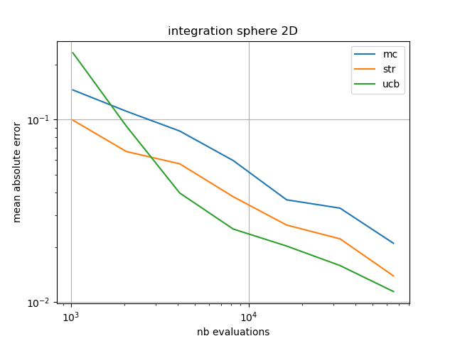
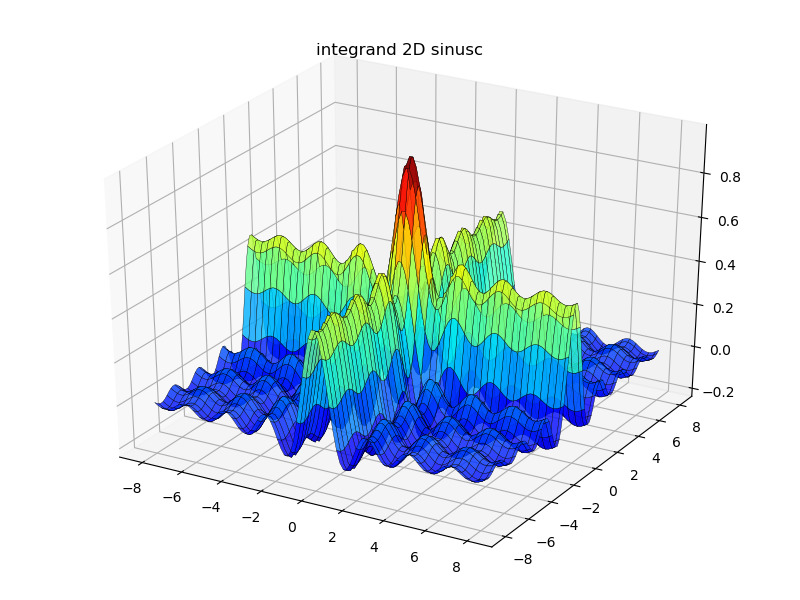

# Ucbature

[](https://travis-ci.org/florianLepretre/ucbature)

This package is a [Julia](http://julialang.org/) implementation of the ucbature
algorithm (a C++/Python implementation of Ucbature is also available, contact
us for more details):

- Florian Leprêtre, Fabien Teytaud, Julien Dehos. 
[Multi-armed bandit for stratified sampling: Application to numerical integration](https://hal.archives-ouvertes.fr/hal-01660617).
TAAI 2017 - Conference on Technologies and Applications of Artificial Intelligence, Dec 2017, Taipei, Taiwan. 

## Quick-start

```julia
Pkg.clone("https://github.com/florianLepretre/ucbature.git")

using ucbature

sphere_func(x) = vecdot(x, x) < 1.0 ? 1.0 : 0.0
dim = 2
xmin = fill(-1.0, dim)
xmax = fill( 1.0, dim)
nb_evals = 1e6
ucbature.mc(sphere_func, xmin, xmax, nb_evals)
```

## Algorithms

- `mc`: Monte-Carlo
- `str`: stratified Monte-Carlo
- `ucb`: Upper Confidence Bound (multi-armed bandit)

## Examples

- `simple_benchmark.jl`: run the algorithms on some integrand functions

- `plot_integrators.jl`: run and plot the algorithms



- `plot_integrands.jl`: plot the example integrand functions



